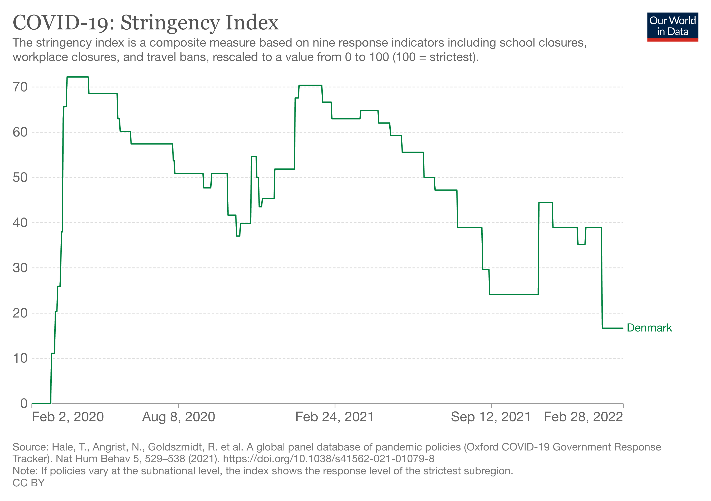

```{r global_options, include=FALSE}
knitr::opts_chunk$set(fig.pos = 'H')
```

```{r, include=FALSE}
library(tidyverse)
library(gridExtra)
library(scales)
library(lubridate)
library(ggplot2)
library(zoo)
library(lme4)
library(lmerTest) 
library(MASS)
library(reshape2)
library(plotly)

```

```{r, include=FALSE}

```

# Abstract
The report aims at understanding the effect of covid restrictions on the deaths from covid in a vaccinated population during the Omicron wave. This is a preliminary case study of Denmark during its ongoing Omicron wave. Denmark is among the most vaccinated population in Europe and was one of the first to drop all covid restrictions. Therefore, it makes for a good example to identify effectiveness of its strategies. We used a linear mixed effect model with new deaths per day as the outcome and hospitalization, restrictions as some of the treatments. Our model suggests that the effect of restrictions on deaths was not significant. 

# Introduction

## Background 

It has been two years since the inception of the Covid-19 Pandemic. By September 2021, almost two years after COVID-19 was first identified, there had been more than 200 million confirmed cases and over 4.6 million lives lost to the disease. (Moore, 21) It has been over 6 months since September 2021 and the world is fight yet another variant of the virus, Omicron. The world is experiencing a huge wave of infection with the omicron variant of SARS-CoV-2. Estimates based on Institute for Health Metrics and Evaluation (IHME) models1 suggest that on around Jan 17, 2022 there were 125 million omicron infections a day in the world, which is more than ten times the peak of the delta wave in April, 2021.(Murray, 2022) The world has been in different stages of lockdown and restrictions during this period and globally faced at least 3 different waves of the variants of the virus.

The omicron variant, which is was declared a Variant of Concern and assigned the name Omicron on 26 November 2021. The Omicron coronavirus variant is likely the fastest-spreading virus in human history, according to experts (Scudellari, 2022). While this variant spread faster than other variants it was considered less severe than Delta. However the WHO cautioned us from categorizing it as a mild variant since its severity was dependent on a multitude of factors. Even if an Omicron infection was less severe compared to Delta, the rapid increase in cases will result in an increase in hospitalizations, putting pressures on health care systems for treating patients with both COVID-19 and other types of disease (WHO, 2022). Consequently, many countries increased covid restrictions during the month of January 2022. In fact, UC Davis also decided to continue remote instructions inorder to prioritize the health of the community during this period.

As we moved past the peak of the omicron variant, Western Countries have begun to ease restrictions on social distancing and masking. Governments worldwide are starting to reduce or eliminate COVID restrictions, as much of the western world begins to consider living with the virus rather than eradicating it (Bove, 2022). As many governments adopt a new strategy, due to highly effective vaccination and booster policy we take a deeper look at whether it is time to drop the guard on stringent covid restrictions. 
As high-income countries begin to ease restrictions, this report will study one such high-income, high-vaccination country, Denmark in the ongoing omicron phase. Denmark became the first country to fully roll back restrictions at the beginning of February. At the time, the country was in the midst of a big wave of new COVID-19 infections, but death and hospitalization numbers were relatively low (Bove, 2022). Our analysis would therefore study the effect of dropping covid restrictions in Denmark, we will also further elaborate on this choice in the section on data background.


## Research Question

How does the change in covid restrictions amidst the Omicron wave affect the deaths recorded in a highly vaccinated and high income population? Additionally, is there a causal relationship between restrictions and deaaths. 

## Motivation 

Our communities are going back to normalcy, the pre-pandemic times. However, CDC Director Rochelle Walensky, MD, says the agency still recommends masking indoors in public settings (Frellick, 2022). Throughout the pandemic, misinformation regarding the policies has lead to more chaos and potentially more lives lost. Therefore, the motivation of this study is to understand how cautious we should be during this time and identify if our government policy is based on relevant metrics or not.

# Data Summary

This analysis will use the country Denmark as a case study and look at new deaths from November 2021 to February 2022. The essential covid-19 metrics in this analysis are number of new cases, number of deaths, hospitalization rate and vaccination rate. In order to account for confounding factors, socio-economic factors such as age distribution of the population, income distribution and other leading causes of diseases in the population will be accounted for. The following sources of data will be considered:

- **Daily cases and Deaths by date reported to WHO** 
  - date reported, new cases 
  
- **Vaccination Data reported to WHO**
  - persons vaccinated per 100, first vaccine date, vaccine type

- **Our world in Data Global Covid Dataset**
A subset of this dataset specifically for Denmark will be considered.
    - Hospital and ICU patients daily (collected by Our World in Data Team), Stringency Index (Oxford Covid-19 Government Response Tracker), population Density, elder_age, life_expectancy, cardiovascular death rate, Diabetes prevalence rate.
    The data is pooled through organizations such as UN, World Bank, OECD, IHME...) therefore, it can be considered reliable. 


# Background

## WHO New Cases and Mortaility data

The data is updated daily from it's inception 3rd January 2020 to present.

- Character/Categorical Variables
  - Country_code
  - Country 
  - WHO_region

- Temporal
  - Date_reported

- Numeric Variables:
  - New_cases
  - Cumulative_cases
  - New_deaths
  - Cumulative_deaths

There is no obvious missing data. Different regions and countries could have errors in reporting as observed minimum new cases is negative which is not possible. Moreover, reporting of deaths has  caveats such as several countries have under reported deaths (insert evidence to support) due to unintentional and intentional errors. 

``` {r, include=FALSE}
vaccine <- read_csv('data/vaccination-data.csv')
covid <- read_csv("https://covid19.who.int/WHO-COVID-19-global-data.csv")


covid <- covid %>% 
  filter(WHO_region != "Other") %>% 
  mutate(WHO_region = fct_recode(WHO_region,                            "Eastern Mediterranean"="EMRO","Europe" = "EURO","Africa" = "AFRO","Western Pacific" = "WPRO","Americas"="AMRO","South-East Asia" = "SEARO"))


```

``` {r, echo = FALSE}
covid$Country[covid$Country == 'United States of America'] <- 'USA'
covid$Country[covid$Country == 'Bolivia (Plurinational State of)'] <- 'Bolivia'

library(maps)
world <- map_data("world");
worldplot <- ggplot() +
  geom_polygon(data = world, aes(x=long, y = lat, group = group)) 


covid.today<- covid %>% 
  filter(Date_reported == "2021-2-18") %>% 
  mutate(region=Country)


covid.today.world<- inner_join(world, covid.today, by = "region")

fig.map  <- ggplot() +
  geom_polygon(data = covid.today.world, aes(x=long, y = lat, group = group,fill=New_deaths)) + 
  coord_fixed(1.3) + ggtitle("New Confirmed Deaths as of 9th March 2022")
fig.map
```

<span>The map above shows that the number of deaths reported in South America specifically Brazil and North America's United States is higher than 1000. Some countries in Europe also have between 500-1000 reported new deaths.</span>


``` {r, echo = FALSE}
covid %>% group_by(WHO_region) %>% 
  filter(Date_reported>= "2021-02-8") %>% 
  summarise(New_cases = max(New_cases), New_deaths = max(New_deaths)) 
```

<span>Americas, Europe and South_east Asie have the highest number of new cases in the last 7 days, this maybe due to a number of factors one being frequent testing especially in parts of Europe and Americas. From this, we infer that considering these regions for analysis is useful as we can assume stricter testing in our inference. The daily death count for these regions is also higher than the rest therefore, it is interesting to see how despite high vaccination rate (see below) these regions have higher tallies. Since the America's includes South American and North American countries with large disparities in socio-economic characteristics we will turn our attention to Europe.</span> 

``` {r, echo = FALSE}
euro_covid = subset(covid, WHO_region == 'Europe')
euro_covid %>% group_by(Country) %>% 
  filter(Date_reported>= "2021-02-8") %>% 
  summarise(New_cases = max(New_cases))  %>% arrange(desc(New_cases)) %>% top_n(n = 5)
euro_covid %>% group_by(Country) %>% 
  filter(Date_reported>= "2021-02-8") %>% 
  summarise(New_deaths = max(New_deaths))  %>% arrange(desc(New_deaths)) %>% top_n(n = 5)

```

<span>From the above graph we see the max new cases and deaths reported by country. Note that, the dataset is looking at daily cases, therefore, the inference from this is volatile. It would be better to check summary statistics with 7 day average after adjusting for population densities in the next iteration.</span>

## Vaccine Data 

<span>This data-set contains vaccination rates, types of vaccines administered and date of first vaccine administration. The dataset has a few missing values that will be dropped.</span>

``` {r, echo = FALSE}
vaccine$COUNTRY[vaccine$COUNTRY == 'United States of America'] <- 'USA'
vaccine$COUNTRY[vaccine$COUNTRY == 'Bolivia (Plurinational State of)'] <- 'Bolivia'

world <- map_data("world");
worldplot <- ggplot() +
  geom_polygon(data = world, aes(x=long, y = lat, group = group)) 


vaccine.today<- vaccine %>% 
  mutate(region=COUNTRY)


vaccine.world<- inner_join(world, vaccine.today, by = "region")

fig.map  <- ggplot() +
  geom_polygon(data = vaccine.world, aes(x=long, y = lat, group = group,fill=PERSONS_FULLY_VACCINATED_PER100)) + 
  coord_fixed(1.3) + ggtitle("Vaccination Rate")
fig.map
```

As per the vaccination rate, the African subcontinent has not vaccinated above 50% of its population. The omicron variant has been said to have originated in this sub-continent.In this case study we will focus on highly vaccinated and boosted populations therefore, the North American and European Regions are strong contenders. 

<span>While the world map gives an overview of the global vaccination rate we are interested in identifying the countries with most vaccinated population for our analysis. From the previous dataset we are interested in exploring the European region </span> 

``` {r, echo = FALSE}
vaccine %>%
  filter(WHO_REGION== "EURO") %>% 
  group_by(COUNTRY) %>% summarise(PERSONS_FULLY_VACCINATED_PER100 = max(PERSONS_FULLY_VACCINATED_PER100)) %>% arrange(desc(PERSONS_FULLY_VACCINATED_PER100)) %>% top_n(n = 5)
```

<span>As seen the highest vaccinated countries are Malta, Faroe Islands, Portugal and Denmark. We will ignore Gibraltar as it is clearly a result of error in reporting. The two countries of interest now are Portugal and Denmark. 

## Why Denmark was chosen

- Both Denmark and Portugal have similar characteristics in terms of vaccination, onset of the omicron variant and testing. However, the population density of Portugal is less than Denmark moreover, the covid restrictions in Portugal were reduced 2 weeks after Denmark giving us insufficient data (last 2 weeks of February) to study. Whereas, Denmark presented the most data upto 28th February (4 Weeks) therefore Protugal was dropped from further consideration.  

- Before the Pandemic, Danes reported being in better health than their European counterparts. Trust in government and among Danish citizens is among the highest in the world and its vaccination campaign has been among the most successful. Pandemic preparedness, democracy, income inequality, universal healthcare, and hospital capacity failed to show a significant relationship with coronavirus infection or fatality rates (Thornton, 2022). The findings indicate that if all societies had trust in government at least as high as Denmark, which is in the 75th percentile, the world would have experienced 13% fewer infections (Thornton, 2022). Based on this, we assume that the citizens of Denmark followed government protocol therefore, reducing discrepanicies caused due to unwillingness to follow protocol.

<span> Addtionally, as motivation if deaths can spike anew in Denmark (see chart below) because of omicron, what might the potential impact be in jurisdictions where there's less social cohesion, where the population is not as healthy, where the medical systems are fragile and where boosters have stalled at lower levels? Therefore, the study of Denmark could be held as a standard for preparedness in similar jurisdictions.</span>


## Other Covariate Data 

<span>For this section, we will be looking at the data collected by Our World in Data. A high-level overview suggests that the dataset has 67 variables composing of information on new cases, mortality, hospitalization,other health conditions and age. There are 747 observation for Denmark where each observation is a single day. All of the observations for variables such as weekly hospitalizations for Denmark is missing from this dataset therefore, these variables are dropped. Moreover, since vaccination began later in the Pandemic the first few months are empty and will be ignored. Other missing observations are few in number, possibly due to error in reporting and so these observations are dropped adopting the listwise deletion method.</span> 

**Age**
<span> As per this dataset, the median population age in Denmark is 42 years with over 19.677% of the population being over the age of 65. Understanding the age distribution of the population is import as the virus disproportionately affected the elderly population in the first and second wave. However, it is important to note that as per this data, majority (> 70%) of the population of Denmark was fully vaccinated by December 2021 which is when the Omicron variant entered the population.</span>

**Health Conditions**
<span>Since we will be looking at the number of covid deaths, one important distinguishing factor to account for is other leading causes of deaths. From this data set we find that diabetes is prevalent in 6.41% of the population and death rate from cardiovascular disease in 2017 (annual number of deaths per 100,000 people) is 114%. The cardiovascular death rate calculated in this dataset is over 100% however, this number doesn't make sense in the context of our analysis. However, the life expectancy at birth for the Danish population 80.9. Therefore, going forward from this value we assume that the population is overall healthy compared to other countries. This assumption is also supported by the human development index which is a composite index that measures the average achievement in three basic dimensions of human development—a long and healthy life, knowledge and a decent standard of living.</span>

**Stringency Index**
<span>Stringency Index is another variable of interest for our analysis. It is sourced from the Oxford Coronavirus Government Response Tracker (OxCGRT). OxCGRT collects publicly available information on 9 indicators of government responses, spanning containment and closure policies (such as such as school closures and restrictions in movement); economic policies; and health system policies (such as testing regimes). This numeric value assigned to the strictness of covid policies ranges from 0 (least restrictive) to 100 (most restrictive). The quantification of the covid restrictions would prove useful in answer the primary question about how fluctuations in this index affect the cases and deaths.</span>



<span>From the chart above, we note that the stringency index for Denmark has been quite high. The index dropped to its lowest since the beginning of the pandemic on February 1st 2022.</span>

**Case Reproduction Rate**

Real-time estimate of the effective reproduction rate (R) of COVID-19 is a variable present in this dataset that we could use in our model to describe the transmisibility of the variant.

**New Cases, New Deaths, Hospitalization and Vaccination Data**

<span>The data set contains multiple descriptions of new cases. New cases are collected by the date of report, therefore the number they report on a given day does not necessarily represent the actual number on that date. To correct this, we consider a 7 day rolling average of the cases to obtain a better estimate.We consider a 7-day smoothing period based on 3 days prior to the date of record, the date of record, and 3 days after the date of record, e.g., based on days n-3, n-2, n-1, n, n+1, n+2, and n+3. We choose 7 days because any period shorter or longer than 7 days risk disproportionately weighing the days on which results were under or over reported. For example, some areas may have limited testing duration on weekends leading lesser tests which maynot be reflective of the population real health. Note that this smoothing approach limits us from using the data from most recent 3 days as these would be empty. While we could devise another smoothing technique for these days based on projecting current days data 3 days into the future, in this report we will choose to not provide smoothed data for these 3 days since this kind of smoothing could introduce errors to the data. A similar smoothing technique also obtains the new deaths.</span>

<span>Hospitalization data is represented by the number of COVID-19 patients in hospital on a given day. The vaccination data presented in the chart below shows the rate of increase in vaccination in Denmark. Note that by the end of July, Denmark had vaccinated 50% of its population and 70% by September 2021. After this point the vaccination rate started to plateau especially after the 80% mark in January. The hospitalization data and increase in new deaths follows the same trend specifically between November 2020 and February 2021 where this is a peak. We see a similar trend in the November 2021 to February 2022. In terms of the new cases, there is peak in mid-February followed by a drop. Note, that a 7 day rolling average of the tests administered shows that the rise in case numbers could also be explained due to increased testing amidst the omicron surge.</span>

``` {r, echo = FALSE,warning=FALSE,message=FALSE }

owid <- read_csv('data/owid-covid-data.csv')
df = subset(owid,location == "Denmark")

df = df[, colSums(is.na(df)) != nrow(df)]
df = df[!is.na(df$new_cases_smoothed_per_million),]
df = df[!is.na(df$new_deaths_smoothed_per_million),]

df$date = as.Date(df$date)

#line data of overall cases per million and over all deaths
denmark_case <- ggplot(df, aes(x=date,y=new_cases_smoothed_per_million)) + geom_line(col=2) +
  scale_x_date(date_labels = "%y %b",date_breaks = "1 month")+
  scale_y_continuous(labels = scales::comma) + theme_classic() + labs(x = "", y= "", color = "")
case <- list(
  text = "New Cases Per million in Denmark",
  xref = "paper",
  yref = "paper",
  yanchor = "bottom",
  xanchor = "center",
  align = "center",
  x = 0.5,
  y = 1,
  showarrow = FALSE
)
den_case_ly <- ggplotly(denmark_case) %>% layout(annotations = case, xaxis = list( tickangle = 45 , tickfont = list(size=8)))

den_deaths <- ggplot(df, aes(x=date,y=new_deaths_smoothed_per_million)) + geom_line(col=2) +
  scale_x_date(date_labels = "%y %b",date_breaks = "1 month") +
  scale_y_continuous(labels = scales::comma) + theme_classic() + labs(x = "", y= "", color = "")
death <- list(
  text = "New Deaths Per 1M",
  xref = "paper",
  yref = "paper",
  yanchor = "bottom",
  xanchor = "center",
  align = "center",
  x = 0.5,
  y = 1,
  showarrow = FALSE
)
den_deaths_ly <- ggplotly(den_deaths) %>% layout(annotations = death, xaxis = list( tickangle = 45 , tickfont = list(size=8)))

den_hosp <- ggplot(df, aes(x=date,y=hosp_patients_per_million)) + geom_line(col=2) +
  scale_x_date(date_labels = "%y %b",date_breaks = "1 month")+
  scale_y_continuous(labels = scales::comma) + theme_classic() + labs(x = "", y= "", color = "")
hosp <- list(
  text = "Hospitalizations Per 1M",
  xref = "paper",
  yref = "paper",
  yanchor = "bottom",
  xanchor = "center",
  align = "center",
  x = 0.5,
  y = 1,
  showarrow = FALSE
)
den_hosp_ly <- ggplotly(den_hosp) %>% layout(annotations = hosp, xaxis = list( tickangle = 45 , tickfont = list(size=8)))

den_vac <- ggplot(df, aes(x=date,y=people_fully_vaccinated_per_hundred)) + geom_line(col=2) +
  scale_x_date(date_labels = "%y %b",date_breaks = "1 month") +
  scale_y_continuous(labels = scales::comma) + theme_classic() + labs(x = "", y= "", color = "")
vac <- list(
  text = "Vaccination Rate (Fully Vaccinated)",
  xref = "paper",
  yref = "paper",
  yanchor = "bottom",
  xanchor = "center",
  align = "center",
  x = 0.5,
  y = 1,
  showarrow = FALSE
)
den_vac_ly <- ggplotly(den_vac) %>% layout(annotations = vac, xaxis = list( tickangle = 45 , tickfont = list(size=8)))


subplot(den_case_ly,den_deaths_ly,den_hosp_ly,den_vac_ly,nrows=4,margin = 0.07, titleX = TRUE, titleY = TRUE) %>% layout(showlegend = FALSE)


```

<span>Zoom into the data presented above for the omicron phase in Denmark. Some trends to note here are that the new cases peaked between Jan =uary 24th and January 31st. At this point the government dropped all the covid restrictions on February 1st therefore, there is a slight dip followed by a similar peak between February 7th - February 21st. After this point the cases have declined. However, the hospitalization and deaths have been on an increase since the restrictions were lifted.</span>

``` {r, echo = FALSE}
df <- df %>% filter(date > "2021-12-13")
denmark_case <- ggplot(df, aes(x=date,y=new_cases_smoothed_per_million)) + geom_line(col=2) +
  scale_x_date(date_labels = "%b %d",date_breaks = "1 week")+
  scale_y_continuous(labels = scales::comma) + theme_classic() + labs(x = "", y= "", color = "")
case <- list(
  text = "New Cases Per million in Denmark",
  xref = "paper",
  yref = "paper",
  yanchor = "bottom",
  xanchor = "center",
  align = "center",
  x = 0.5,
  y = 1,
  showarrow = FALSE
)
den_case_ly <- ggplotly(denmark_case) %>% layout(annotations = case, xaxis = list( tickangle = 45 , tickfont = list(size=8)))

den_deaths <- ggplot(df, aes(x=date,y=new_deaths_smoothed_per_million)) + geom_line(col=2) +
  scale_x_date(date_labels = "%b %d",date_breaks = "1 week") +
  scale_y_continuous(labels = scales::comma) + theme_classic() + labs(x = "", y= "", color = "")
death <- list(
  text = "New Deaths Per 1M",
  xref = "paper",
  yref = "paper",
  yanchor = "bottom",
  xanchor = "center",
  align = "center",
  x = 0.5,
  y = 1,
  showarrow = FALSE
)
den_deaths_ly <- ggplotly(den_deaths) %>% layout(annotations = death, xaxis = list( tickangle = 45 , tickfont = list(size=8)))

den_hosp <- ggplot(df, aes(x=date,y=hosp_patients_per_million)) + geom_line(col=2) +
  scale_x_date(date_labels = "%b %d",date_breaks = "1 week")+
  scale_y_continuous(labels = scales::comma) + theme_classic() + labs(x = "", y= "", color = "")
hosp <- list(
  text = "Hospitalizations Per 1M",
  xref = "paper",
  yref = "paper",
  yanchor = "bottom",
  xanchor = "center",
  align = "center",
  x = 0.5,
  y = 1,
  showarrow = FALSE
)
den_hosp_ly <- ggplotly(den_hosp) %>% layout(annotations = hosp, xaxis = list( tickangle = 45 , tickfont = list(size=8)))


subplot(den_case_ly,den_deaths_ly,den_hosp_ly,nrows=3,margin = 0.07, titleX = TRUE, titleY = TRUE) %>% layout(showlegend = FALSE)


```


``` {r, include = FALSE}
owid <- read_csv('data/owid-covid-data.csv')
denmark = subset(owid,location == "Denmark")
portugal = subset(owid,location == "Portugal")

summary(denmark)
```

# Methods and Model

## Inferencial Analysis 

<span>In this section, we will look at the period when Omicron was dominant in Denmark. Based on the data obtained, the Omicron Variant accounted for 50% of the cases in Denmark on December 25th which is the holiday season and the Stringency Index around this time was 38.8 (for reference the no restriction index is around 16.67). The variant became dominant in the begining of January. During this time hospitalizations, deaths and cases surged considerably as seen above. A 7-day rolling averge of deaths shows that the deaths are increasing even as the peak has passed. Note the increase in deaths in February 2022 in the chart above. Due to limitations on data availability, for the scope of this project, we would have to study the omicron wave upto this point. Note, the month of January had stricter covid restrictions, however from February 1st, the covid restrictions were dropped. This gives us two months to make comparisions based on the index. While making these comparisions we will have to define parameters based on the SIR model for Omicron i.e Answer questions such as what is the incubation period? What is the recovery time? What is the infection rate?. The incubation period is usually 2-4 days and the average recovery time is about 5 days. Therefore, the one month windows we are considering may be sufficient to test the difference in Stringency Index. Therefore, we extract a variable for `week` and `month`to use in our model. `Week` is based on dates starting from 13th December (50th week of 2021) up to the 8th week of 2022 (Feb 28th). Additionally, since the intent is to test the importance of covid restrictions during the Omicron wave, we choose to transform the numeric `stringency_index` to a categorical variable `restriction` which has 5 levels 0,1,2,3,4 starting from No restrictions to the strictest restrictions. The numeric range for each level is of length 20. Consequently for the period of investigation, Omicron, the levels of restriction are 0 (February 2022 onwards) and 1 (December - January). As seen from the chart above, the hospitalization rate was the highest since the begining of the pandemic. Therefore, `hospital_patients` encompassing the new hospital admits per day is considered in our model. Since the vaccination rate is has somewhat plateaued during this time its effect is not quantified in our model. The model will assume that majority of the population is fully vaccinated and therefore has some increased immunity compared to previous waves.</span>


## Model Propositions

<span> Our model aims at understanding the significance of restrictions in Denmark during the Omicron wave. The models under consideration are linear regression and mixed effect models. The response variable is the rolling average of new deaths per day. This response variable was chosen over others such as new deaths per million as we were testing the effect for just one population and all other predictor variables also followed the same convention of rolling average aggregate per day therefore, the model was consistent in itself. In our linear regression model, we observed that some predictors such as `week` was significant during the peaks which makes sense however, this was non independent therefore, we moved to a linear mixed models to introduce fixed and random effects. In our model we consider the `hospital patients`, `restriction` and `new_cases_smoothed` to be the fixed effect and the random effects are `week` and `reporduction rate`. `Week` was chosen as a random effect due to dependencies.</span>

Linear Mixed Model:

$$y = X\beta + Z\mu + \epsilon$$


- $y$ is the column vector; where the outcome is the new deaths each day
- $\beta$ is a column vector of fixed effects regression coefficients, where the effects are hospitalizations, covid restriction level and new covid cases 
- $X$ is the design matrix describing the relation between outcome and predictors
- $Z$ is the design matrix describing the relation between outcome and random effects
- $u$ is the vector of random effects, week and reproduction rate 
- $\epsilon$ vector of random errors


**Model Assumptions**

- $\epsilon \sim \mathcal{N}(0,\,R)$ ; $R = I\sigma_{\epsilon}^2$
- $u \sim \mathcal{N}(0,\,G)$ ; $G$ is the variance-covariance matrix of the random effects
- $cov(u,\epsilon) = 0$


# Results 

``` {r, echo = FALSE, message = FALSE}

owid <- read_csv('data/owid-covid-data.csv')

denmark = subset(owid,location == "Denmark")
df = denmark[, colSums(is.na(denmark)) != nrow(denmark)]

keep_1 <- c('new_deaths_smoothed', 'new_cases_smoothed', 'hosp_patients' , 'new_people_vaccinated_smoothed_per_hundred', 'reproduction_rate', 'date', 'icu_patients','stringency_index', 'hospital_beds_per_thousand', 'population_density')

df = subset(df, select= keep_1)

omicron_phase <- df %>% filter(date > "2021-12-13")

df_complete = df_complete <- omicron_phase[complete.cases(omicron_phase), ]

#convert stringency index to categories 

df_complete <- df_complete %>% 
  mutate(restriction = as.factor(case_when(stringency_index <= 20 ~ 0,(stringency_index > 20 & stringency_index <= 40) ~ 1, (stringency_index > 40 & stringency_index <= 60) ~ 2,(stringency_index > 60 & stringency_index <= 80) ~ 3,(stringency_index > 80 & stringency_index <= 100) ~ 4 )))

#month
df_complete <- df_complete %>% 
  mutate(month = as.factor(month(ymd(df_complete$date))))

#week 
df_complete <- df_complete %>% 
  mutate(week = as.factor(isoweek(ymd(df_complete$date))))
```

``` {r, echo = FALSE, warning = FALSE}
fit_7 <- lmer(new_deaths_smoothed ~  hosp_patients + restriction  + (1|reproduction_rate) + (1|week) + new_cases_smoothed, df_complete)
```


``` {r, echo = FALSE}
knitr::kable( anova(fit_7) )

```

<span>From fitting the model described we get the following results. The p-values are obtained from a F test. The test results can be interpreted as showing a statistically significant linear association between the outcome and the predictors. As per the table above, there is a linear association between the hospital patients and the new deaths at significance level 0.05. This relationship is as expected because, hospitalizations are usually for severe cases of covid. Contrary to the trend observed previously, the change in restriction and new deaths is not statistically significant as the p-value 0.317 $<$ F-value 1.0254. Therefore, without a significant result we cannot conclude that covid restrictions were necessary during the omicron wave. However, there was spike in cases and deaths from Feb 7th - Feb 21st, after the covid restrictions were dropped in Denmark. The results obtained here suggest that the spike was not due to change in restrictions. We will need to further investigate this in the sensitivity analysis section. The model also suggested that the new cases per day didn't have a statistically significant impact at level 0.05. There is still some association at significance level 0.01. This maybe due to the fact that, the omicron variant infected many people but the recovery rate was high. From the result, we note that the hospitalization data explains majority of the new deaths. In the next section we will conduct a sensitivity analysis of this model and further discuss certain abnormalities in the result presented.</span>

## Causal Inference

In order to conduct causal inference we need to reduce the bias introduced due to covariates such as new cases and hospitalizations. The significance of these cannot be ignored but better quantified with more detailed covariates in furture models. Due to this, it possible that there exists a string selection bias in our data due to which we cannot conduct proper causal inference. 


``` {r, echo = F, include = F}

fit_9 <- lmer(new_deaths_smoothed ~  hosp_patients + restriction + (1|month) + (1|reproduction_rate), df_complete)
anova(fit_9)
summary(fit_9)
par(mfrow = c(2, 2))
plot(fit_9)
qqnorm(resid(fit_9)) 
qqline(resid(fit_9))

fit_10 <- lmer(new_deaths_smoothed ~  hosp_patients + restriction + (1|week) + (1|reproduction_rate), df_complete)
anova(fit_10)
summary(fit_10)
par(mfrow = c(2, 2))
plot(fit_10)
qqnorm(resid(fit_10)) 
qqline(resid(fit_10))

```

# Sensitivity Analysis

## Model Diagnostics

```{r, echo = FALSE}
plot(fit_7)
qqnorm(resid(fit_7)) 
qqline(resid(fit_7))
```

From the diagnostic plots we see that:

- The residuals vs fitted plots show no obvious pattern. The residuals are scattered randomly and equally around 0 therefore the error terms have 0 means and equal variance. 
- The Q-Q plot is a probability plot of the standardized residuals against the values that would be expected under normality. The plot here shows that the values are along a straight line with less probability mass on the left and right tails. However, since the plot doesn't deviate much, we interpret that the distribution of error terms is close to a Normal distribution. 

## Effect of the Spike in February

As discussed in the results, we expected the spike in deaths and cases and February to relate to the change in restriction level that was introduced on 1st February. (EXPLAIN WHAT EXACTLY THE CHANGE MEANT - NO MASKS ETC). In order to observe the sensitivity of the model to a change in this time frame we propose the following:

**Remove this time frame from the data and observe the change in the model**

<span>The intuition behind bringing this change is to observe if the model is sensitive to the change in this time period. If it is then, we know that the model didn't encompass enough information and we need to add more explanatory covariates to describe the time-period. From the results of this new model, we see that the results change only slightly. The new cases is no longer a statistically significant at level 0.1. Moreover, the estimates obtained from the summary show a 1 unit increase for all predictors. These changes could be due to many reasons,<span>

<span>**1) Insufficient data**, we are trying to study the population of Denmark for a very short time period. In our model categorically classifying stringency index simplified the data for interpretation into just two groups (No restriction, Moderate Restriction), however, over the entire period of the pandemic restrictions would contain 5 groups. If the changes, were better quantified, then perhaps a relation could be established between restrictions and deaths. Therefore, would be beneficial to explore if the restrictions were significant in the previous waves. However, in context of our primary question, our scope is the Omicron wave.</span> 

<span> **2) Oversimplification of Covariates** While `hosp_patients` is an important factor in explaining the deaths. This variable encompasses a variety of information not known to us for example, the age distribution of these patients. How many of them were critically ill? What were the in-patient service days which describes the fully staffed hospital beds available for the duration of the patients stay, number of icu patients, hospital and proportion of immuno-compromised patients. If the patients in the hospital were high-risk, then perhaps a change in restriction would not have affected the outcome by large if they were to contract the virus. If the patients were from all age groups, and health conditions then clearly, the restrictions would play a significant role worth investigating.</span>

``` {r, echo = FALSE, warning = FALSE}
df_remove_spike = df_complete %>% filter(week != 6 & week != 7)
fit_7_no_spike = lmer(new_deaths_smoothed ~  hosp_patients + restriction  + (1|reproduction_rate) + (1|week) + new_cases_smoothed, df_remove_spike)
knitr::kable( anova(fit_7_no_spike))
```


# Discussion and Conclusion

## Discussion 

<span>My findings suggest that dropping all the covid restrictions was not a significant factor in the increase in deaths surging the Omicron wave in Denmark. They also suggest that hospitalizations per day were a stronger and more significant indicator of the new deaths (p-value= 1.41e-12 at level = 0.05). However, there are major caveats of this analysis that consequently make drawing causal inference from these findings invalid. While the assumptions of the linear model described are satisfied, we belive the concern is due to the nature of the dataset under analysis and the variates.</span>

<span> We are studying a time-series data where each observation is aggregates per day. Since we are looking at just one country from a global dataset, we are not able to utilize information such as elder ratio, number of hospital beds, proportion of at risk population. Due to the lack of these values, we could not build a model that accurately describes the population of Denmark besides our prior knowledge about Denmark that is unknown to our model. Perhaps, a dataset with cases at a city/county level would benefit our analysis further. In our analysis, we wanted to study about 13 weeks of the omicron wave - one major caveat here is that the Omicron wave is still on-going in Denmark therefore, the spike in deaths and cases could have been due to the wave reaching its peak at the end of the 7th Week which is 1 week after the restriction was dropped, and hence maybe the restriction drop had no significant relation to the spike.</span>

<span> Another caveat discussed earlier, is that the short time frame of the analysis didn't accurately quantify the significance of covid restrictions that we saw earlier in the pandemic. Perhaps, a comparative study between the Omicron wave and the Delta wave where about 50% of the population of Denmark was fully vaccinated would shed more light on the effectiveness of the restrictions.The delta variant was dominant in Denmark from June 4th 2021 to December 13th 2021. The population of Denmark was 50% fully vaccinated by the end of July. Therefore, if we compare the periods where vaccination was high with an overlap of the Delta variant dominance then we achieve similar conditions in terms of immune strength of the population to the Omicron Phase.</span>

<span> Another concern, due to the nature of uncertainty of the virus is that the spike could be due to a different variant or sub-variant that is more potent and perhaps it is too early for the government of Denmark to catch this difference which led to laxing the policy however, effects of this could only be explained by observing the cases and mortality over March and perhaps this data would change the result of our model.</span>

<span> In our analysis, we assumed that the population has a strong immunity to fight the virus due to the high vaccination rate. However, one major caveat of this assumption is that we assume the vaccine is effective on the Omicron variant There are studies proving the effectiveness of the vaccine however, there are concerns regarding the wanning effect of the vaccine i.e it becoming less effective as time passes. The omicron period would fall into this wanning period, however, we don't have any quantifiable covariate to effectively encompass the vaccination status in our model. Since `people fully vaccinated per 100` has been stagnant for the period of December - February. If our assumption fails, then that could also explain the rise in deaths.</span>

<span> An important by product of this analysis was the observation that, high hospitalization rate had a direct linear association with death. Based on this, we can infer that burden on hospitalization is a metric of concern with regards to deaths. A future study of this metric as an outcome with regards to restrictions/stringency could help better quantify the effect of restrictions. As we've seen that high case count didn't lead to nearly as high death count but it could show that there is high transmission and this could relate to significance of restrictions.</span>


## Conclusion

In conclusion, our analysis cannot subscribe to conducting a causal inference using the data. However, we suggest additional controls and confounders that could help overcome this challenge in future iterations. From our analysis, we see that deaths and hospitalizations in Denmark are rising. Denmark has been a country with high-covid restrictions throughout the pandemic, high vaccination rates and high trust in the government. Moreover, the life expectancy of the population is also about 81 years. Therefore, in someways it is comparable to other first-world nations in the west. As seen from our analysis, the policy change, dropping all covid restrictions was did not significantly affect the deaths in Denmark. 

This analysis however, is not an evidence against the effectiveness of stringent covid policies. The weakness of the analysis fail to make a case for restrictions but it also suggests a new direction of investigation which is the hospitalization rate. The linear mixed model showed a positive relation between hospitalization and deaths. Moreover, There is a correlation between hospital rates and restrictions and perhaps this outcome indirectly explains the deaths. Factors such as new variants, mutations are beyond our control but health care response is, therefore, my next direction for this project would be to study the impact of dropping restrictions on hospitalization. 

# Reference 

Thornton, Jacqui. “Covid-19: Trust in Government and Other People Linked with Lower Infection Rate and Higher Vaccination Uptake.” The BMJ, British Medical Journal Publishing Group, 2 Feb. 2022, https://www.bmj.com/content/376/bmj.o292. 

“The Omicron Variant: Sorting Fact from Myth.” World Health Organization, World Health Organization, 19 Jan. 2022, https://www.euro.who.int/en/health-topics/health-emergencies/pages/news/news/2022/01/the-omicron-variant-sorting-fact-from-myth. 

Henderson, Sarah Moore Reviewed by Emily. “History of Covid-19.” News, 28 Sept. 2021, https://www.news-medical.net/health/History-of-COVID-19.aspx. 

Murray, Christopher  J L. “COVID-19 Will Continue but the End of the Pandemic Is Near.” 19 Jan. 2022, https://www.thelancet.com/journals/lancet/article/PIIS0140-6736(22)00100-3/fulltext. 

Bove, Tristan. “From New York to the Netherlands, the (Western) World Is Moving on from Omicron. Here's Where the Big Rollback Is Happening.” Fortune, Fortune, 12 Feb. 2022, https://fortune.com/2022/02/12/us-europe-rolling-back-covid-restrictions/. 

Frellick, Marcia. “As CDC Holds the Line, Doctors Debate Lifting Mask Mandates.” WebMD, WebMD, 10 Feb. 2022, https://www.webmd.com/lung/news/20220210/mask-mandates-falling-as-cdc-urges-patience. 

Scudellari, Megan. “Omicron's Surprising Anatomy Explains Why It Is Wildly Contagious.” Scientific American, Scientific American, 11 Feb. 2022, https://www.scientificamerican.com/article/omicrons-surprising-anatomy-explains-why-it-is-wildly-contagious/. 

# Session info {-}

```{r}
sessionInfo()
```


# Code Appendix {-}
```{r ref.label=knitr::all_labels(), echo = T, eval = F}
```

